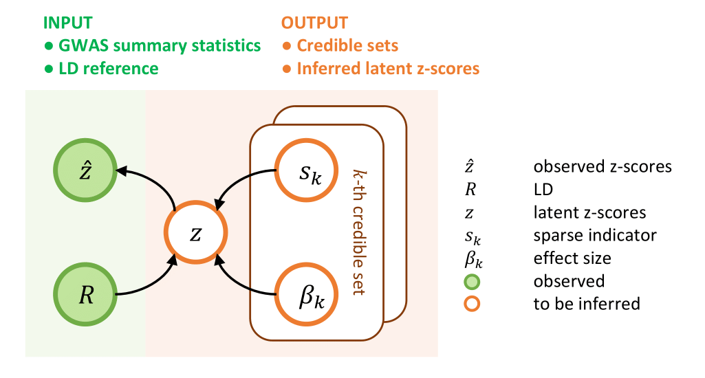

# RSparsePro for robust fine-mapping

RSparsePro is a command line tool for robust fine-mapping in the presence of LD mismatch. For analysis conducted in the paper, please refer to [RSparsePro_LD_analysis](https://github.com/zhwm/RSparsePro_LD_analysis).

## Overview 

RSparsePro takes GWAS summary statistics (z-scores) and an LD reference panel (LD matrix) as input. In RSparsePro, we introduce a latent variable to address potential inconsistencies between the GWAS population and the LD reference panel, enabling robust fine-mapping.


<p align="center">
  
  <br>
  <em>Figure 1: RSparsePro overview.</em>
</p>

## Installation

SharePro was developed under Python 3.9.7 but should be compatible with other versions of Python 3. The following Python modules are required:

* [numpy](http://www.numpy.org/)
* [scipy](http://www.scipy.org/)
* [pandas](https://pandas.pydata.org/getpandas.html)

To install RSparsePro for robust fine-mapping:

```
git clone https://github.com/zhwm/RSparsePro_LD.git
cd RSparsePro_LD
pip install -r requirements.txt 
``` 

To test the installation and display basic usages:
```
python src/rsparsepro_ld.py -h
```

## Input files

Example input files are included in the [dat](dat/) directory. 

1. The **z-score** file: The column for z-scores must have the header 'Z', and the column for SNP index must have the header 'RSID'. Both columns are required. You may include additional columns in the file, but RSparsePro will not utilize other information. An example can be found at [test.z.txt](dat/test.z.txt).

2. The **LD** file: The LD file contains the LD matrix, which includes the Pearson correlation between each pair of variants, with values separated by a single space. An example can be found at [dat/ld.txt](dat/ld.txt).

**While RSparsePro can handle allele flipping, it is strongly recommended to ensure the REF/ALT alleles used in calculating the LD matrix match those from the GWAS study.**

## Usage examples

We use `--z` and `--ld` to indicate the path to the zscore file and the ld file, respectively. Additionally, we can specify the path to save results with `--save`.

```
python src/rsparsepro_ld.py \
--z dat/test.z.txt \
--ld dat/ld.txt \
--save dat/test
```

## Output files

After a successful execution of RSparsePro, we will append three new columns to the input z-score file in the output [result file](dat/test.rsparsepro.txt): `PIP` for posterior inclusion probability, `z_estimated` for estimated latent z-scores, and `cs` for credible sets. Variants in credible sets will have non-zero values in the `cs` column.

Additionally, the [log file](dat/test.rsparsepro.log) records the execution process of the algorithm.

## Citations

If you find RSparsePro useful, please cite: